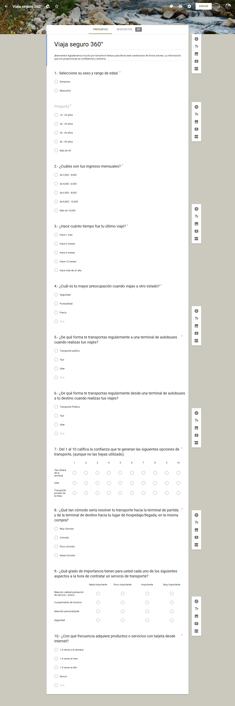

## El objetivo del proyecto es Conocer todo el proceso de diseño de una solución tecnológica.

## Entregable:

Presentación sobre la oportunidad detectada.
Landing page sobre la solución.
Prototipo de la solución web/móvil.

## El Equipo se dividira en 3 personas:

1. Dueño de producto
2. UX Design
3. UX Research

## Fecha de entrega:
Lunes 26 de Febrero

## Fecha de presentación:
Martes 27 de Febrero

## PROBLEMA A OPTIMIZAR: Entender y Optimizar el journey de tomar un camión de CDMX a Cuernavaca.

## VIAJE SEGURO 360

Identificar la Oportunidad de Negocio.

## Enunciado del Problema

Definir una alternativa para aquellos usuarios que tienen complicaciones al buscar un método de traslado seguro desde su punto de partida hasta la terminal, y de la terminal a su destino, esto en conjunto con partners locales que nos ayudarán en el proceso de traslado de nuestro usuario, de manera eficiente, segura y cómoda.

## Objetivos a cumplir para el usuario

Hacerlo sentir que viaja seguro.
Facilitarle el traslado entre sus punto de partida, hasta su destino.
Que el usuario se sienta cómodo.

## Perfil de Ususario

Adulto-joven
Sabe de tecnología
Tiene tarjeta de crédito
Área metropolitana
+$4,000MN
No es viajero frecuente
Viaja por placer
Viaja acompañado
Vive solo
Es organizado

## Se crea una encuesta para obtener mas información

Entre el equipo se sugieren varias preguntas, se seleccionan las siguentes:

Cuestionario Final

1. Seleccione su sexo.  >> Validamos sexo del usuario
Femenino
Masculino

Seleccione su rango de edad.  >> Validamos edad del usuario
18 - 25 años
25 - 35 años
35 - 45 años
45 - 55 años
Más de 55 años

2. ¿Cuáles son tus ingresos mensuales? >> Validamos ingresos del usuario
3,500 - 4,000
4,000 - 6,500
6,500 - 8,000
8,000 - 10,000
Más de 10,000

3. ¿Hace cuánto fue tu último viaje? >> Validamos si ha viajado recientemente o ha pasado un tiempo considerable en que no viaja
Hace 1 mes
Hace 3 meses
Hace 6 meses
Hace 12 meses
Hace más de un año.

4. ¿Cuál es tu mayor preocupación cuando viajas a otro estado? >> Validamos painpoints del usuario
Seguridad
Puntualidad
Precio
Otro ¿cuál?

5. ¿De qué forma te transportas regularmente a una terminal de autobuses cuando realizas tus viajes? >> Valida poder adquisitivo y decisiones de compra
Transporte público
Taxi
Uber
Otro ¿cuál?

6. ¿De qué forma te transportas regularmente desde una terminal de autobuses a tu destino cuando realizas tus viajes? >> Valida poder adquisitivo y  decisiones de compra
Transporte público
Taxi
Servicio privado
Otro ¿cuál?

7. Del 1 al 10 califica la confianza que te generan las siguientes opciones de transporte (aunque no las hayas utilizado). >> Valida lealtad y confianza con servicios
Taxi afuera de la terminal
Uber
Transporte privado de la línea
Otro

8. ¿Qué tan cómodo sería para usted contratar un servicio de transporte hacia la terminal de partida y de la terminal de destino hacia tu lugar de hospedaje/llegada en la misma compra? >> Valida si la propuesta es agradable para los usuarios
Muy cómodo
Cómodo
Poco cómodo
Nada cómodo

9. ¿Qué grado de importancia tienen para usted cada uno de los siguientes aspectos a la hora de contratar un servicio de transporte? >>
Relación calidad prestación de servicio / precio
  Muy importante    Importante    Poco importante    Nada importante
Cumplimiento de horarios
  Muy importante    Importante    Poco importante    Nada importante
Atención personalizada   
  Muy importante    Importante    Poco importante    Nada importante
Seguridad
  Muy importante    Importante    Poco importante    Nada importante

10. ¿Con qué frecuencia adquiere productos o servicios con tarjeta desde Internet? >> Valida hábitos de consumo
1 - 4 veces a la semana
1 - 4 veces al mes
1 - 4 veces al año
Nunca

Se utilizo herramienta Google Forms para que el usuario sienta más confianza de abrir el link y contestar la encuesta, se compartio en redes sociales como Facebook, slack, whatsapp y redes sociales de viajeros.

<!-- IMAGEN ENCUESTA -->

## CONCLUSIÓN

La encuesta se cerró con 67 respuestas:
Una de las mayores preocupaciones de los usuarios que viajan a otro estado es la seguridad (en su mayoría mujeres prefieren seguridad sobre precio).
 El 49.3% de los usuarios utilizan servicios como Taxi o Uber para trasladarse de su casa a la terminal de autobuses.
El 66.7% de los usuarios utilizan servicios como Taxi o Uber trasladarse de la terminal a su destino.
El 48% de los encuestados utilizan uber porque es más seguro y práctico de utilizar.
El taxi fuera de la terminal obtuvo media de 5 debajo de servicios como Uber o transporte privado de la línea.
El 74.6% de los encuestados ha realizado compras por Internet y 44.7% lo hace de manera regular.
A 73.1% (49 personas) de nuestros encuestados, les resultaría cómodo resolver su transporte hacia la terminal y posteriormente a su destino, en una misma compra. A 22.4% (15 personas) les resultaría cómodo.
